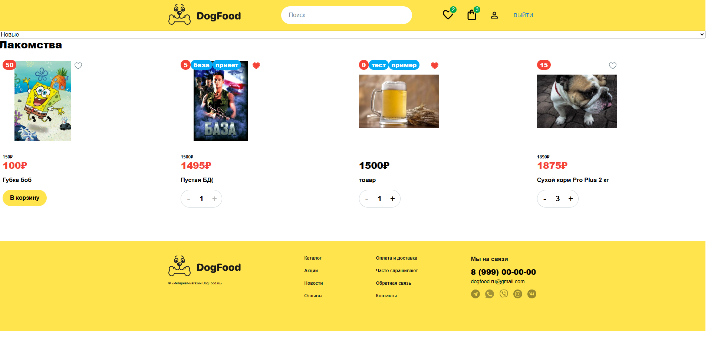
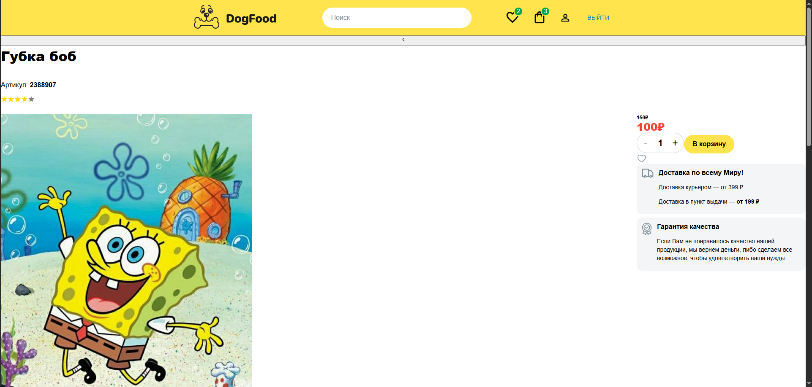
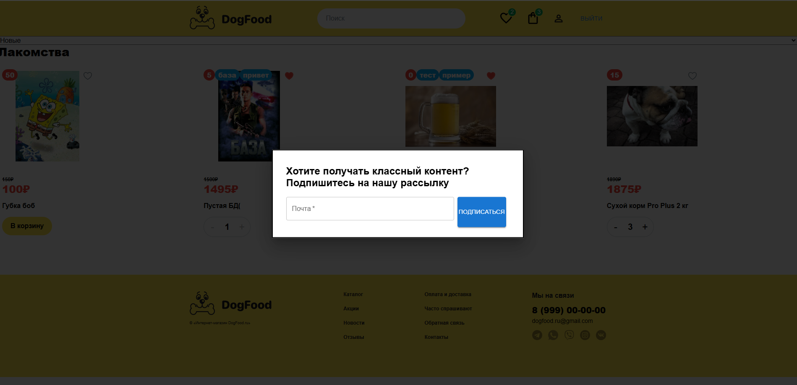
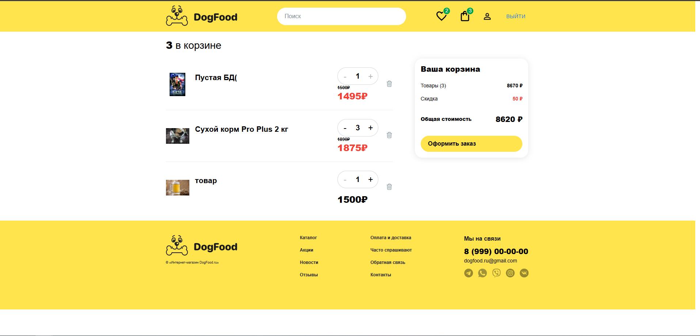
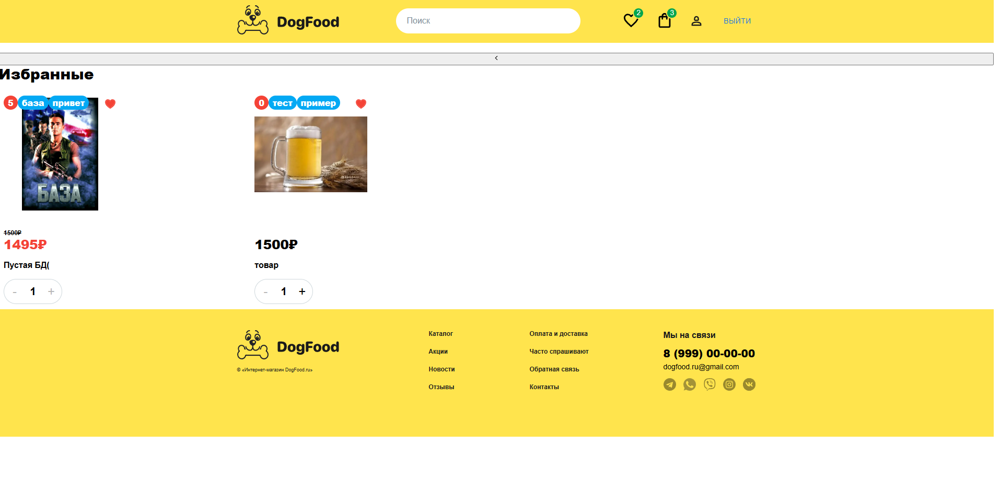
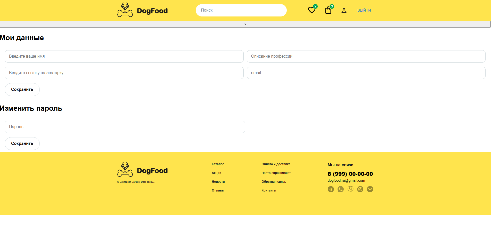
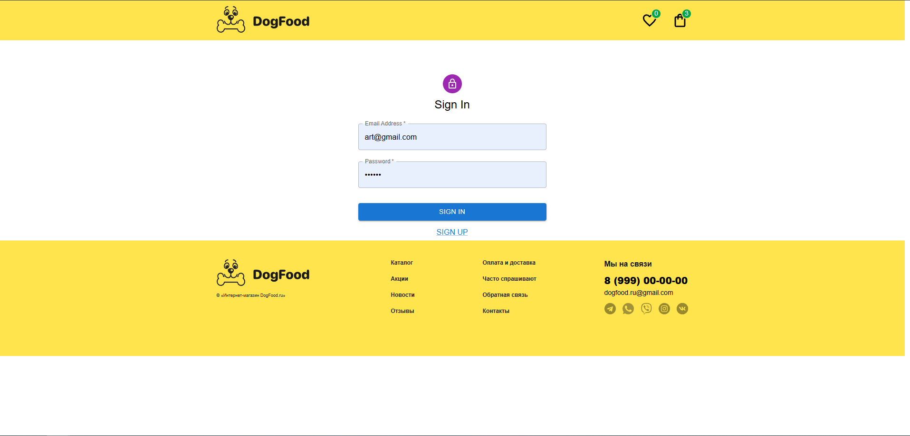
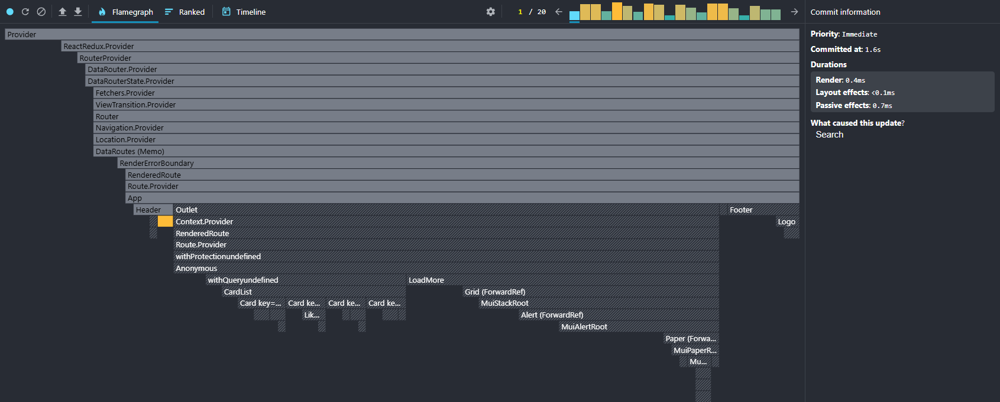
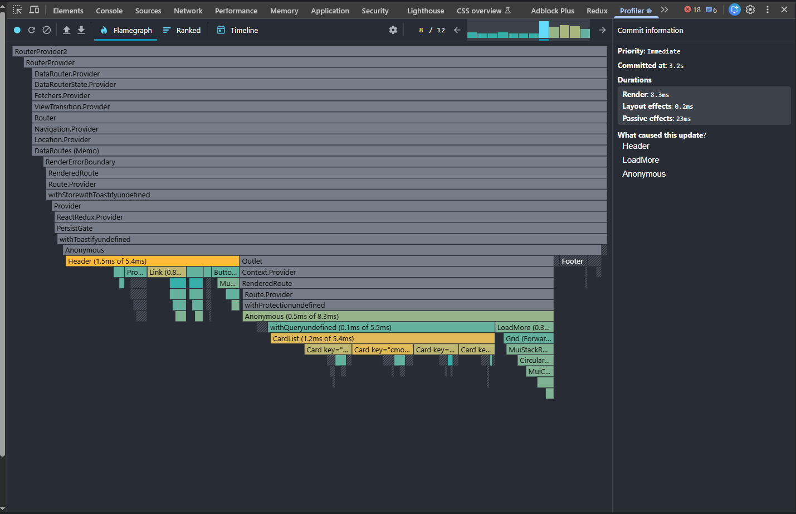

# Что сделано
 - Реструктурирован проект с соблюдением методологии FSD
 - Найдены и устранены лишние ререндеры и проблемные места (Поиск с некорректным debounce, ререндер всех карточек при изолированном изменении одной карточки)
 - Добавлено модально окно с использованием React.Portal
 - настроен eslint с правилами для FSD
 - добавлен redux-persist для сохранения accessToken и корзины
 - Оптимистичное обновление лайка
 - useActionState в диалог с подпиской на email рассылку

 - # Структура проекта
```+---dist
+---public
|   |   index.html
|   |   
|   \---static
|       +---icons
|       |       back.svg
|       |       like.svg
|       |       logo.svg
|       |       quality.svg
|       |       star.svg
|       |       trash.svg
|       |       truck.svg
|       |       
|       \---images
|               instagram.svg
|               telegram.svg
|               viber.svg
|               vk.svg
|               whatsapp.svg
|               
+---readme_images
|       webpack_build.png
|       webpack_dev_start.png
|       
+---src
|   |   custom.d.ts
|   |   index.tsx
|   |   
|   +---app
|   |   |   app.module.css
|   |   |   AppEntry.tsx
|   |   |   index.ts
|   |   |   
|   |   +---providers
|   |   |   |   index.ts
|   |   |   |   
|   |   |   +---RTK
|   |   |   |       index.tsx
|   |   |   |       store.ts
|   |   |   |       
|   |   |   \---toastify
|   |   |           index.tsx
|   |   |           
|   |   +---routing
|   |   |   |   index.ts
|   |   |   |   
|   |   |   \---config
|   |   |           router.tsx
|   |   |           
|   |   \---styles
|   |           normalize.css
|   |           styles.css
|   |           
|   +---entities
|   |   +---product
|   |   |   |   index.ts
|   |   |   |   
|   |   |   +---api
|   |   |   |       productsApi.ts
|   |   |   |       
|   |   |   +---lib
|   |   |   |       useProducts.ts
|   |   |   |       
|   |   |   +---model
|   |   |   |       types.ts
|   |   |   |       
|   |   |   +---store
|   |   |   |       productsSlice.ts
|   |   |   |       
|   |   |   \---ui
|   |   |           Card.module.css
|   |   |           Card.tsx
|   |   |           
|   |   \---user
|   |       |   index.ts
|   |       |   
|   |       +---model
|   |       |       types.ts
|   |       |       
|   |       \---store
|   |               user.ts
|   |               
|   +---features
|   |   +---Auth
|   |   |   |   index.ts
|   |   |   |   
|   |   |   \---lib
|   |   |           useLogout.ts
|   |   |           WithProtection.tsx
|   |   |           
|   |   +---Cart
|   |   |   |   index.ts
|   |   |   |   
|   |   |   +---lib
|   |   |   |       useCartProductCounter.ts
|   |   |   |       
|   |   |   +---store
|   |   |   |       cart.ts
|   |   |   |       
|   |   |   \---ui
|   |   |       \---CartCounter
|   |   |               CartCounter.module.css
|   |   |               CartCounter.tsx
|   |   |               
|   |   +---LikeProductButton
|   |   |   |   index.ts
|   |   |   |   
|   |   |   \---ui
|   |   |           LikeProductButton.tsx
|   |   |           
|   |   +---LoadMore
|   |   |   |   index.ts
|   |   |   |   
|   |   |   +---hooks
|   |   |   |       useLoadMore.ts
|   |   |   |       
|   |   |   \---ui
|   |   |           LoadMore.tsx
|   |   |           
|   |   +---ProductSearch
|   |   |   |   index.ts
|   |   |   |   
|   |   |   +---lib
|   |   |   |       usePostsSearchForm.ts
|   |   |   |       
|   |   |   \---ui
|   |   |           ProductSearch.module.css
|   |   |           ProductSearch.tsx
|   |   |           
|   |   \---ProductsSort
|   |       |   index.ts
|   |       |   
|   |       +---hooks
|   |       |       useProductsSort.ts
|   |       |       
|   |       \---ui
|   |               ProductsSort.tsx
|   |               
|   +---pages
|   |   +---CartPage
|   |   |   |   index.ts
|   |   |   |   
|   |   |   \---ui
|   |   |       |   CartPage.module.css
|   |   |       |   CartPage.tsx
|   |   |       |   
|   |   |       +---CartCheckout
|   |   |       |   |   index.ts
|   |   |       |   |   
|   |   |       |   \---ui
|   |   |       |           CartCheckout.tsx
|   |   |       |           
|   |   |       +---CartItem
|   |   |       |   |   index.ts
|   |   |       |   |   
|   |   |       |   \---ui
|   |   |       |           CartItem.tsx
|   |   |       |           
|   |   |       \---CartList
|   |   |           |   index.ts
|   |   |           |   
|   |   |           \---ui
|   |   |                   CartList.tsx
|   |   |                   
|   |   +---FavoritesPage
|   |   |   |   index.ts
|   |   |   |   
|   |   |   +---lib
|   |   |   |       useFavoriteProducts.ts
|   |   |   |       
|   |   |   \---ui
|   |   |           FavoritesPage.tsx
|   |   |           
|   |   +---HomePage
|   |   |   |   index.ts
|   |   |   |   
|   |   |   \---ui
|   |   |           HomePage.tsx
|   |   |           
|   |   +---NotFoundPage
|   |   |   |   index.ts
|   |   |   |   
|   |   |   \---ui
|   |   |           NotFoudPage.module.css
|   |   |           NotFoundPage.tsx
|   |   |           
|   |   +---ProductPage
|   |   |   |   index.ts
|   |   |   |   
|   |   |   \---ui
|   |   |           ProductPage.module.css
|   |   |           ProductPage.tsx
|   |   |           
|   |   +---ProfilePage
|   |   |   |   index.ts
|   |   |   |   
|   |   |   \---ui
|   |   |           ProfilePage.module.css
|   |   |           ProfilePage.tsx
|   |   |           
|   |   +---SignInPage
|   |   |   |   index.ts
|   |   |   |   
|   |   |   \---ui
|   |   |           SignInPage.tsx
|   |   |           
|   |   \---SignUpPage
|   |       |   index.ts
|   |       |   
|   |       \---ui
|   |               SignUpPage.tsx
|   |               
|   +---shared
|   |   +---hooks
|   |   |       index.ts
|   |   |       useCount.ts
|   |   |       useDebounce.ts
|   |   |       
|   |   +---lib
|   |   |       compose.ts
|   |   |       index.ts
|   |   |       PortalWrapper.tsx
|   |   |       
|   |   +---store
|   |   |   |   index.ts
|   |   |   |   
|   |   |   +---api
|   |   |   |       authApi.ts
|   |   |   |       baseQuery.ts
|   |   |   |       index.ts
|   |   |   |       types.ts
|   |   |   |       
|   |   |   +---HOCs
|   |   |   |       index.ts
|   |   |   |       WithQuery.tsx
|   |   |   |       
|   |   |   \---slices
|   |   +---types
|   |   |       global.d.ts
|   |   |       
|   |   +---ui
|   |   |   +---ButtonBack
|   |   |   |   |   index.ts
|   |   |   |   |   
|   |   |   |   \---ui
|   |   |   |           ButtonBack.tsx
|   |   |   |           
|   |   |   +---Dialog
|   |   |   |   |   index.ts
|   |   |   |   |   
|   |   |   |   \---ui
|   |   |   |           Dialog.module.css
|   |   |   |           Dialog.tsx
|   |   |   |           
|   |   |   +---DogFoodLogo
|   |   |   |   |   index.ts
|   |   |   |   |   
|   |   |   |   \---ui
|   |   |   |           DogFoodLogo.module.css
|   |   |   |           DogFoodLogo.tsx
|   |   |   |           
|   |   |   +---LikeButton
|   |   |   |   |   index.ts
|   |   |   |   |   
|   |   |   |   \---ui
|   |   |   |           LikeButton.module.css
|   |   |   |           LikeButton.tsx
|   |   |   |           
|   |   |   +---Price
|   |   |   |   |   index.ts
|   |   |   |   |   
|   |   |   |   \---ui
|   |   |   |           Price.module.css
|   |   |   |           Price.tsx
|   |   |   |           
|   |   |   \---Rating
|   |   |       |   index.ts
|   |   |       |   
|   |   |       \---ui
|   |   |               Rating.tsx
|   |   |               
|   |   \---utils
|   |           getMessageFromError.ts
|   |           index.ts
|   |           isLiked.ts
|   |           
|   \---widgets
|       +---CardList
|       |   |   index.ts
|       |   |   
|       |   \---ui
|       |           CardList.module.css
|       |           CardList.tsx
|       |           
|       +---Footer
|       |   |   index.ts
|       |   |   
|       |   \---ui
|       |           Footer.module.css
|       |           Footer.tsx
|       |           
|       +---Header
|       |   |   index.ts
|       |   |   
|       |   \---ui
|       |           Header.module.css
|       |           Header.tsx
|       |           
|       +---newsletter
|       |   |   index.tsx
|       |   |   
|       |   +---api
|       |   |       sendEmail.ts
|       |   |       
|       |   +---model
|       |   |       index.ts
|       |   |       validator.ts
|       |   |       
|       |   \---ui
|       |       |   NewsLetter.tsx
|       |       |   
|       |       +---EmailForm
|       |       |       EmailForm.tsx
|       |       |       
|       |       +---Error
|       |       |       Error.tsx
|       |       |       
|       |       +---Loader
|       |       |       Loader.tsx
|       |       |       
|       |       \---SuccessfullSubscribption
|       |               SuccessfullSubscribption.tsx
|       |               
|       +---ReviewList
|       |   |   index.ts
|       |   |   
|       |   \---ui
|       |       |   ReviewList.module.css
|       |       |   ReviewList.tsx
|       |       |   
|       |       \---ReviewForm
|       |               ReviewForm.module.css
|       |               ReviewForm.tsx
|       |               
|       +---SignInForm
|       |   |   index.ts
|       |   |   
|       |   +---ui
|       |   |       SignInForm.tsx
|       |   |       
|       |   \---utils
|       |           types.ts
|       |           validator.ts
|       |           
|       \---SignUpForm
|           |   index.ts
|           |   
|           +---ui
|           |       SignUpForm.tsx
|           |       
|           \---utils
|                   validator.ts
|                   
\---webpack
        webpack.common.js
        webpack.config.js
        webpack.dev.js
        webpack.prod.js
|   .env
|   .eslintignore
|   .eslintrc.js
|   .gitignore
|   .prettierignore
|   .prettierrc.js
|   .stylelintignore
|   .stylelintrc.json
|   img.png
|   img_1.png
|   img_2.png
|   img_3.png
|   img_4.png
|   img_5.png
|   img_6.png
|   package-lock.json
|   package.json
|   postcss.config.js
|   README.md
|   tree.txt
|   tree2.txt
|   tsconfig.json 
```

# Скриншоты

## Главная
 

## Продукт


## Модальное окно с формой с useActionState


## Корзина


## Избранное


## Профиль


## Вход


## Оптимизация поиска
 - ДО
 - 
 - ПОСЛЕ
 - 